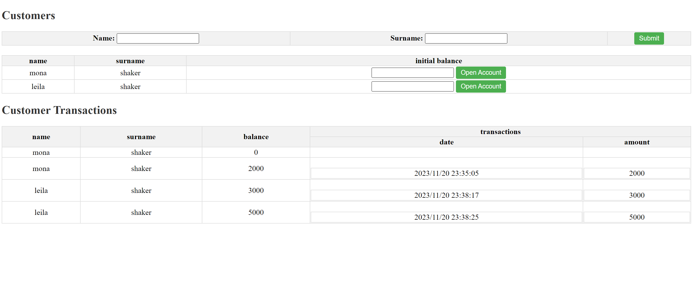

# Wallet

The Spring Boot based Application for manage customers and transactions of their accounts

## Table of Content

- Tech Stack
- Run And Deployment
- UI
- Project Architecture
- API Reference
- Future Improvement
- Authors
- Social Media Links

## Tech Stack

- Java 17
- Spring Boot 3.1.5
- Maven
- Postgres DB
- Thymeleaf
- testContainer

## Run And Deployment

For run this project, you must install docker first and after that doing flowing steps.

- Build Artifact with maven
- run with docker compose with command docker-compose up -d

## UI

- you can see it on http://localhost:8080/home
  

# Project Architecture

## Overview

This project utilizes a microservices architecture with service registration and discovery facilitated by Netflix
Eureka. The system consists of three components:

1. **Eureka Server:** A centralized service registry for managing the registration and discovery of microservices.
2. **Transaction Service:** The first microservice that registers itself with Eureka.
3. **Account Service:** The second microservice that registers itself with Eureka.

## Components

### Eureka Server

- **Description:** Eureka server acts as the central point for service registration and discovery.
- **Endpoint:** http://localhost:8761
- **Usage:** Microservices (Transaction and Account) register themselves with Eureka for service discovery.

### Transaction Service

- **Description:** Responsible for creating and getting list of transactions for each account.
- **Endpoint:** http://localhost:8082
- **Interaction:** Communicates with Account microservice and is discoverable through Eureka.

### Account Service

- **Description:** Responsible for creating customer,opening account for them and sending request to transaction service
  for making transaction.
- **Endpoint:** http://localhost:8081
- **Interaction:** Communicates with other microservices and is discoverable through Eureka.

## API Reference

Swagger dependency is configured for account service.
After launching the project you can see it on http://localhost:8081/swagger-ui.html

## Future Improvement

1. create a project for configuration management
2. config CI/CD 

## Authors

- [@Mona Shakerdonyavi](https://github.com/shakerdonyavi)

## 🔗 Social Media Links

